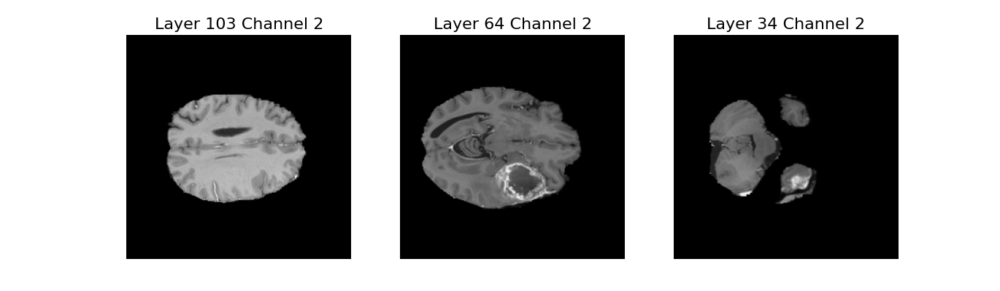

# Brain Tumor Auto-Segmentation using deep learning(U-net)
## MRI data pre-processing
MRI data can be freely downloaded from the decathulon 10 challenge site. This data preprocessed for the purpose of the competition.

Single image file contains a 4D array of MRI image in the shape of (240, 240, 155, 4). The first three dimention is called Voxel and the fouth dimention '4' denotes four sequences such as 

1. 0 - Fluid Attenuated Inversion Recovery(FLAIR) 
2. 1 - T1-weighted(T1w)
3. 2 - T1-weighted with gadolinium contrast enhancemen(t1gd)
4. 3 - T2-weighted(T2w)

<figure>

<figcaption> Single example from training set</figcaption>
</figure>

<figure>

<figcaption> label of the single example from the training example</figcaption>
</figure>

